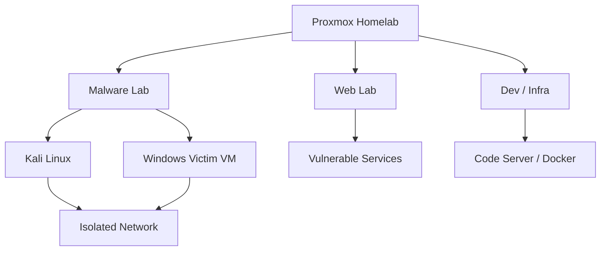

# 👋 Hi, I'm Kangmin Kim

### 🛡️ Information Security · System Security · Reverse Engineering

정보보호 분야를 목표로 공부하고 있습니다.
시스템 보안과 리버스 엔지니어링을 중심으로 학습하고,
실습 내용을 기록하고 작은 보안 도구를 만들어가고 있습니다.

> Interested in system security, reverse engineering,
> malware analysis, and digital forensics.

---

## 🛠️ Tech Stack

### 💻 Languages

  

### 🔧 Tools & Environment

**Analysis Tools:** GDB · x64dbg · NASM · HxD · Wireshark · FTK Imager

## 🔍 Current Focus

- x86-64 assembly and calling conventions
- Linux process, memory, stack, and heap
- ELF and PE binary analysis
- Static and dynamic malware analysis
- Network and digital forensics fundamentals

---

## 🧪 Security Lab

개인 Proxmox 홈랩에서 Kali Linux와 Windows 분석 VM을 운영합니다.
악성코드 실습용 네트워크를 분리하고 스냅샷으로 실험 환경을 복구합니다.

## 📦 Projects & Study Notes

- [Security Study](https://github.com/Kezluno2621/Kezluno-Workspace))
  - 리버싱 및 보안 실습 기록

---
## 📊 GitHub Stats

  
  

---

# 📫 Contact

- 📧 **Email:** [kim051902@naver.com](mailto:kim051902@naver.com)
- 📝 **Naver Blog:** [blog.naver.Kezluno](https://blog.naver.com/revrow2621)

---

## 👨‍💻 Background

- 🎓 Computer Engineering
- ✈️ ROK Air Force CERT (2024.11–2026.08)

---

  <b>Security · Development · Research</b>

